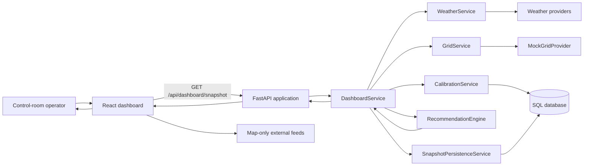
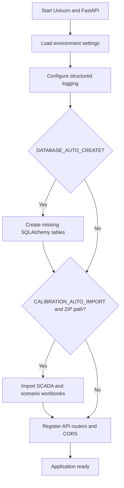
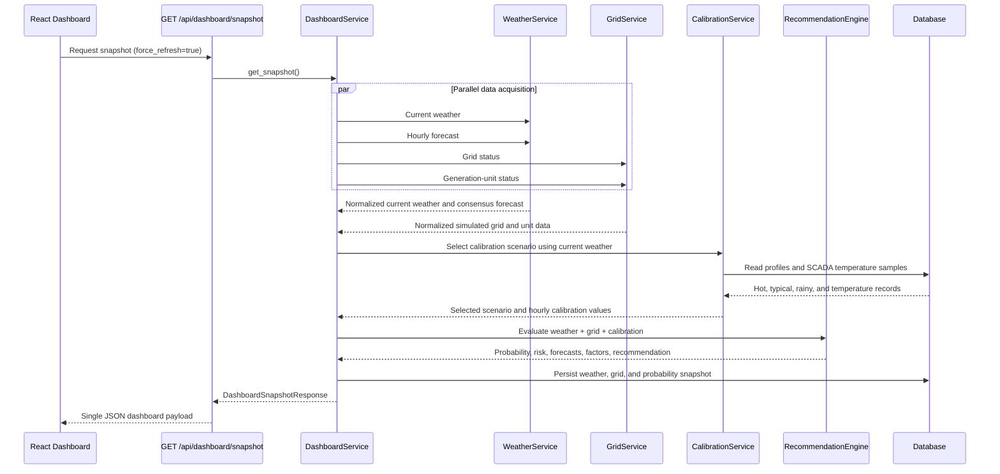
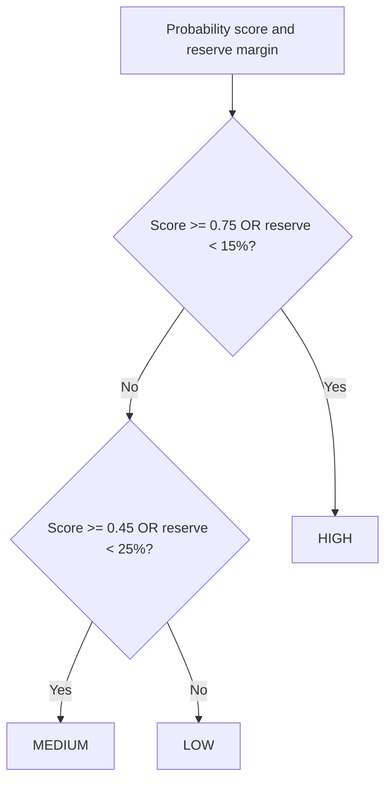
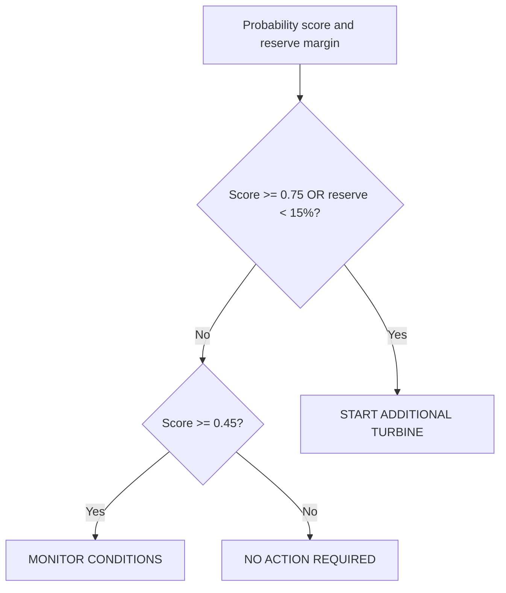
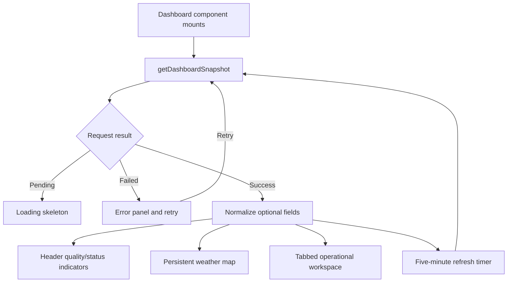
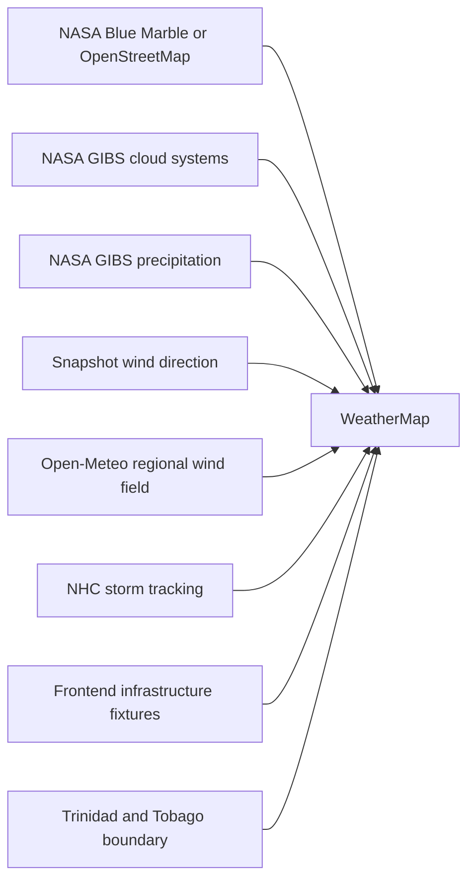
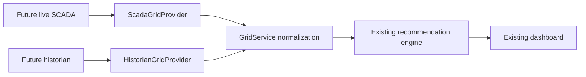

# WGDSS Program Flow and Decision Logic

## 1. Document Purpose

This document explains how the T&TEC Weather-Based Generation Decision
Support System (WGDSS) runs, how data moves through the application, why each
decision rule exists, and how the system converts weather and grid conditions
into operator guidance.

The system is a decision-support tool. It does not directly start, stop, or
dispatch generating units. Its purpose is to:

- combine weather, forecast, grid, and calibration information;
- estimate near-term demand pressure;
- calculate the probability that additional generation may be required;
- classify the operational risk;
- recommend an operator response;
- explain the conditions that influenced the result;
- preserve snapshots for future analysis.

## 2. Current Data Reality

The dashboard intentionally combines live and simulated information:

| Data area | Current source | Status |
|---|---|---|
| Current weather | Open-Meteo Best Match, with provider failover | Live |
| Hourly forecast | Open-Meteo, MET Norway, and NOAA GFS consensus | Live |
| Grid demand and generation | `MockGridProvider` | Simulated |
| SCADA temperature | Imported historical workbook samples | Calibration data |
| Hot/typical/rainy demand profiles | Imported workbook scenarios | Calibration data |
| Cloud and rainfall map imagery | NASA GIBS | Live/recent imagery |
| Wind flow map | Open-Meteo regional coordinate grid | Live when enabled |
| Tropical storms | NOAA/NHC Current Storms feed | Live when enabled |
| Infrastructure map layers | Frontend coordinate fixtures | Simulated/reference |

Imported SCADA information is not a live SCADA connection. It is used to
calibrate scenario selection and demand forecasting. Future live SCADA and
historian providers should replace the mock grid provider without changing the
dashboard or recommendation contracts.

## 3. Top-Level Program Structure



## 4. Application Startup Flow



Startup is designed to remain resilient. Calibration import failure is logged
but does not prevent the API from starting. The dashboard can therefore operate
with live weather and simulated grid data even if calibration data is missing.

## 5. Dashboard Snapshot Flow

The frontend uses one aggregate request to avoid separate weather, grid,
forecast, probability, and recommendation round trips.



The browser requests a fresh snapshot on initial load and every five minutes.
The UI preserves loading, error, retry, and fallback rendering states.

## 6. Weather Acquisition and Normalization

### 6.1 Current weather

1. `WeatherService` checks its five-minute service cache unless a forced refresh
   is requested.
2. The primary provider is Open-Meteo Best Match.
3. If the primary provider fails, the configured fallback is tried:
   - Open-Meteo NOAA GFS by default; or
   - WeatherAPI.com when explicitly enabled and configured.
4. Provider data is normalized into:
   - temperature;
   - humidity;
   - rainfall rate;
   - cloud cover;
   - wind speed and direction;
   - pressure;
   - condition;
   - heat index;
   - rain severity;
   - timestamp and provider name.

### 6.2 Forecast consensus

The normal forecast path requests data concurrently from:

- Open-Meteo Best Match, weight `0.50`;
- MET Norway, weight `0.30`;
- NOAA GFS through Open-Meteo, weight `0.20`.

Hourly periods are aligned by UTC hour and reconciled using weighted means.
Precipitation probability uses the maximum reported probability because an
operator should not lose a rain signal merely because another model predicts a
lower value.

Forecast confidence starts at `0.96` when at least two providers succeed.
Disagreement in temperature, cloud cover, and rainfall reduces confidence. The
result is clamped between `0.58` and `0.96`. A single-source forecast receives
confidence `0.68` and is marked as degraded consensus.

### 6.3 Weather classifications

Rain severity is assigned as follows:

| Rainfall | Classification |
|---|---|
| `0 mm/hr` | `DRY` |
| Greater than `0` and below `2 mm/hr` | `LIGHT` |
| `2` to below `7 mm/hr` | `MODERATE` |
| `7` to below `20 mm/hr` | `HEAVY` |
| `20 mm/hr` or greater | `EXTREME` |

The heat-index approximation is:

```text
heat_index_c = temperature_c + (0.033 × humidity_percent) - 0.70
```

This approximation is a normalized operational indicator, not a medical heat
index calculation.

## 7. Grid Simulation Logic

Version 1 uses `MockGridProvider`. It returns fixed generation-unit capability
and output values, then chooses demand from the Trinidad local hour:

| Local time | Demand period | Simulated demand |
|---|---|---|
| 00:00-05:59 | Night | 700 MW |
| 06:00-11:59 | Morning | 850 MW |
| 12:00-16:59 | Afternoon | 950 MW |
| 17:00-21:59 | Evening peak | 1000 MW |
| 22:00-23:59 | Late night | 750 MW |

Available capacity and current generation are summed from the mock generation
units. Reserve margin is:

```text
reserve_margin_percent =
    (available_capacity_mw - current_demand_mw)
    / max(current_demand_mw, 1)
    × 100
```

Grid status is:

| Reserve margin | Grid status |
|---|---|
| Below 10% | `CRITICAL` |
| 10% to below 20% | `WATCH` |
| 20% or greater | `NORMAL` |

The provider interface isolates the rest of the application from the source.
A future SCADA provider can return the same normalized grid structure.

## 8. Calibration and Scenario Selection

### 8.1 Imported calibration data

The calibration importer reads:

- SCADA ambient-temperature workbooks for hot, typical, and rainy days;
- the load-forecasting workbook containing hourly demand and spinning reserve;
- source archive, workbook, sheet, quality, and import provenance.

Only SCADA temperature rows with `Good` quality are used to construct normal
temperature traces when available.

### 8.2 Scenario scoring

At the current Trinidad hour, each scenario receives:

```text
scenario_score =
    (weather_fit × 0.75)
    + (temperature_similarity × 0.25)
```

Temperature similarity is:

```text
max(0, 1 - abs(current_temperature - scenario_temperature) / 8)
```

Weather-fit emphasis varies by scenario:

- **Rainy:** rainfall, cloud cover, humidity, and rain-related condition text.
- **Hot:** temperature above 27°C, humidity above 60%, and low rainfall.
- **Typical:** temperature near 28°C, low rainfall, and cloud cover near 45%.

The highest score is selected. Selection confidence is:

```text
confidence = clamp(0.5 + (highest_score - second_highest_score), 0, 1)
```

The selected scenario contributes:

- calibrated SCADA temperature;
- demand at the current profile hour;
- demand at the next profile hour;
- spinning reserve at the current and next profile hours;
- a human-readable selection reason.

Calibration enriches the decision but never blocks snapshot delivery. If the
database is unavailable or no profiles exist, the engine continues without it.

## 9. Probability Engine

### 9.1 Purpose

The probability score represents operational pressure for additional
generation, not the mathematical probability of a guaranteed event. It is a
transparent rule-based index between `0.00` and `1.00`.

The engine begins with a baseline score of `0.25`. This represents ordinary
background uncertainty and prevents normal conditions from being treated as
absolute zero risk.

### 9.2 Input effects

| Input condition | Score effect | Operational purpose |
|---|---|---|
| Temperature at least 30°C | Add up to `0.22` | Cooling demand generally rises in hotter conditions |
| Humidity at least 70% | Add up to `0.18` | High humidity increases cooling burden |
| Rainfall at least 2 mm/hr | Subtract up to `0.12` | Rain can suppress short-term cooling and activity demand |
| Cloud cover at least 50% | Subtract up to `0.06` | Reduced solar heating can slightly reduce load |
| Demand exceeds current generation | Add up to `0.35` | Indicates immediate supply pressure |
| Reserve margin below 30% | Add up to `0.30` | Reduced flexibility increases operational exposure |
| Demand exceeds available capacity | Add `0.20` | Capacity is insufficient for current demand |
| Scenario demand exceeds generation | Add up to `0.22` | Imported operating profile indicates higher expected load |
| Scenario spin below 15% of demand | Add up to `0.12` | Imported reserve profile is below the planning threshold |

The exact weather adjustments are:

```text
temperature_boost = min((temperature_c - 29) × 0.05, 0.22)
humidity_boost    = min((humidity_percent - 68) × 0.015, 0.18)
rain_reduction    = min(rainfall_mm_hr × 0.03, 0.12)
cloud_reduction   = min((cloud_cover_percent - 50) × 0.0015, 0.06)
```

Only the applicable conditions are evaluated. The final score is rounded to two
decimal places and clamped to `0.00-1.00`.

### 9.3 Risk classification



### 9.4 Recommendation selection



The recommendation deliberately remains small and actionable. The supporting
factor list preserves explainability so operators can see which inputs raised
or reduced the result.

## 10. Near-Term Demand Forecast

The 30-minute and 60-minute demand forecasts are deterministic planning
estimates.

Weather pressure is:

```text
if temperature > 29:
    add (temperature - 29) × 4.5 MW

if humidity > 70:
    add (humidity - 70) × 0.8 MW

if rainfall >= 2:
    subtract rainfall × 1.5 MW

if cloud cover >= 50:
    subtract (cloud cover - 50) × 0.12 MW
```

The 30-minute projection applies the weather pressure directly. The 60-minute
projection multiplies it by `1.25`.

When calibration is present, the weather-driven projection is averaged with
the selected scenario demand. The 60-minute scenario anchor uses the average of
the current and next scenario hours. Forecast demand cannot fall below 92% of
current demand:

```text
forecast = max(current_demand × 0.92, projected_demand)
```

The logic provides a stable near-term indicator for Version 1. It is not machine
learning and should be recalibrated as verified operational history grows.

## 11. Data-Quality Logic

The dashboard labels data quality so an operator can distinguish normal,
fallback, stale, simulated, and calibrated data.

- Weather is stale when its observation age exceeds 5,400 seconds.
- Weather is marked `FALLBACK` when a fallback provider supplied data.
- Weather is marked `CALIBRATED` when the provider name indicates SCADA
  calibration.
- Grid status is marked `SIMULATED` while `MockGridProvider` is active.
- Calibration is `UNAVAILABLE` when profiles are absent.
- Forecast consensus is degraded when fewer than two forecast sources succeed.
- Persistence failure does not fail the snapshot; it adds a degraded-quality
  note.

## 12. Frontend Presentation Flow



The workspace tabs divide responsibilities:

- **Home:** concise weather and demand overview.
- **Operations:** station dispatch and unit readiness.
- **Weather:** current conditions and the next six forecast hours.
- **Demand:** demand chart, scenario profile, and near-term forecasts.
- **Risk:** probability gauge and directional risk factors.
- **Guidance:** operator actions and threshold headroom.
- **Analytics:** calibration summary and scenario-curve comparison.

## 13. Map Flow

The Leaflet map is independent from the recommendation engine. Map overlays
improve situational awareness but do not alter probability calculations.



Cloud and rainfall imagery are enabled initially. Wind direction is supplied by
the dashboard snapshot. Wind flow is optional and requests a 63-point
Open-Meteo field only when enabled, caches it for 15 minutes, interpolates the
nearest four vectors, and animates 220 canvas particles. Storm tracking is also
optional and refreshes every 15 minutes.

## 14. Persistence Flow

When snapshot persistence is enabled:

1. normalized current weather is stored in `weather_observations`;
2. grid status is stored in `grid_data`;
3. probability, risk, forecasts, recommendation, and factors are stored in
   `probability_results`.

Persistence is intentionally non-blocking. A database write failure degrades
the data-quality status but still returns the live dashboard response.

The `forecasts`, `recommendations`, `generation_units`, `historical_analysis`,
and `users` tables exist as foundations but are not all populated by the active
snapshot flow.

## 15. Future SCADA Flow



The future providers must implement the existing `GridProvider` contract and
return the normalized fields already used by `GridService`. This preserves the
API, probability engine, frontend types, and dashboard components.

