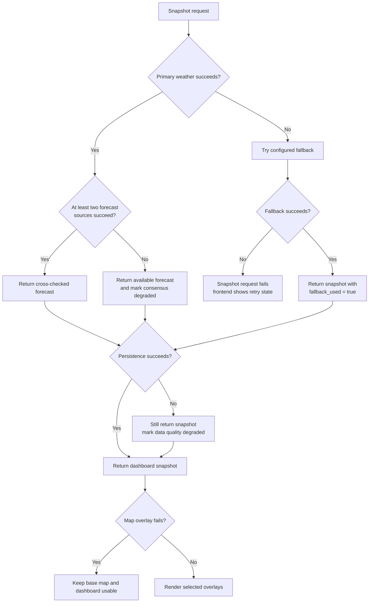

# WGDSS Comprehensive Top-Down Data and Logic Flow

> This visual contains legacy prototype thresholds. The authoritative SCADA
> and operating-policy context is `docs/SCADA_OSI_CONTEXT.md`; all utility
> thresholds require confirmation.

This document shows how WGDSS starts, acquires data, normalizes and evaluates
conditions, persists results, and renders the operator dashboard.

## End-to-End Program Flow

```mermaid
flowchart TD
    USER["Control-room operator<br/>Browser at localhost:5173"]

    subgraph STARTUP["1. Application Startup"]
        direction TB
        FE_START["Vite starts React application<br/>frontend/src/main.tsx"]
        BE_START["Uvicorn starts FastAPI<br/>backend/app/main.py"]
        DB_INIT{"DATABASE_AUTO_CREATE?"}
        CREATE_DB["Create SQLAlchemy tables<br/>initialize_database()"]
        IMPORT_CHECK{"CALIBRATION_AUTO_IMPORT<br/>and ZIP path configured?"}
        IMPORT_JOB["Read calibration ZIP and XLSX files<br/>CalibrationImportService"]
        IMPORT_STORE["Store import provenance,<br/>SCADA temperatures, and<br/>24-hour scenario profiles"]

        BE_START --> DB_INIT
        DB_INIT -- Yes --> CREATE_DB
        DB_INIT -- No --> IMPORT_CHECK
        CREATE_DB --> IMPORT_CHECK
        IMPORT_CHECK -- Yes --> IMPORT_JOB --> IMPORT_STORE
        IMPORT_CHECK -- No --> API_READY["FastAPI ready"]
        IMPORT_STORE --> API_READY
        FE_START --> UI_READY["React dashboard ready"]
    end

    USER --> FE_START
    USER --> BE_START

    subgraph REFRESH["2. Dashboard Refresh Cycle"]
        direction TB
        DASHBOARD["Dashboard component mounts<br/>frontend/src/pages/Dashboard.tsx"]
        TIMER["Initial request, then refresh every 5 minutes"]
        CLIENT["getDashboardSnapshot()<br/>frontend/src/services/api.ts"]
        HTTP["GET /api/dashboard/snapshot<br/>force_refresh=true"]
        ROUTE["FastAPI dashboard route<br/>backend/app/api/dashboard.py"]
        AGGREGATOR["DashboardService.get_snapshot()<br/>backend/app/services/dashboard_service.py"]

        UI_READY --> DASHBOARD --> TIMER --> CLIENT --> HTTP --> ROUTE --> AGGREGATOR
        TIMER -. every 5 min .-> CLIENT
    end

    subgraph ACQUIRE["3. Concurrent Operational Data Acquisition"]
        direction LR

        subgraph WEATHER["Weather Path"]
            direction TB
            WS_CURRENT["WeatherService.get_current_weather()"]
            WS_FORECAST["WeatherService.get_forecast()"]
            WCACHE{"Fresh 5-minute<br/>service cache?"}
            PRIMARY["Open-Meteo Best Match<br/>Primary current + forecast"]
            CONSENSUS_A["MET Norway<br/>Forecast cross-check"]
            CONSENSUS_B["Open-Meteo NOAA GFS<br/>Forecast cross-check"]
            FALLBACK{"Primary/current or<br/>all forecast sources fail?"}
            FALLBACK_FREE["Open-Meteo GFS fallback"]
            FALLBACK_KEYED["WeatherAPI fallback<br/>only when enabled and keyed"]
            NORMALIZE_W["Normalize units and fields<br/>temperature, humidity, rain,<br/>cloud, wind, pressure,<br/>condition, heat index"]
            RECONCILE["Reconcile hourly forecasts<br/>provider-weighted values,<br/>source spread, confidence,<br/>precipitation probability"]
            WEATHER_OUT["Current weather +<br/>ordered hourly forecast"]

            WS_CURRENT --> WCACHE
            WS_FORECAST --> WCACHE
            WCACHE -- Hit --> WEATHER_OUT
            WCACHE -- Miss --> PRIMARY
            WS_FORECAST --> CONSENSUS_A
            WS_FORECAST --> CONSENSUS_B
            PRIMARY --> FALLBACK
            FALLBACK -- Current succeeds --> NORMALIZE_W
            FALLBACK -- Failure, free mode --> FALLBACK_FREE --> NORMALIZE_W
            FALLBACK -- WeatherAPI enabled --> FALLBACK_KEYED --> NORMALIZE_W
            PRIMARY --> RECONCILE
            CONSENSUS_A --> RECONCILE
            CONSENSUS_B --> RECONCILE
            NORMALIZE_W --> WEATHER_OUT
            RECONCILE --> WEATHER_OUT
        end

        subgraph GRID["Grid Path - Version 1"]
            direction TB
            GRID_SERVICE["GridService"]
            GRID_PROVIDER["GridProvider interface"]
            MOCK_GRID["MockGridProvider"]
            CLOCK["Current Trinidad local hour"]
            DEMAND_CURVE["Select demand period<br/>Night 700 MW<br/>Morning 850 MW<br/>Afternoon 950 MW<br/>Evening peak 1000 MW<br/>Late night 750 MW"]
            UNITS["Mock generation-unit outputs<br/>and available capacities"]
            GRID_CALC["Calculate total generation,<br/>capacity, reserve margin,<br/>grid status and demand period"]
            GRID_OUT["Normalized grid status +<br/>generation units"]

            GRID_SERVICE --> GRID_PROVIDER --> MOCK_GRID
            MOCK_GRID --> CLOCK --> DEMAND_CURVE
            MOCK_GRID --> UNITS
            DEMAND_CURVE --> GRID_CALC
            UNITS --> GRID_CALC --> GRID_OUT
        end

        AGGREGATOR --> WS_CURRENT
        AGGREGATOR --> WS_FORECAST
        AGGREGATOR --> GRID_SERVICE
    end

    subgraph CALIBRATION["4. Calibration and Scenario Selection"]
        direction TB
        CAL_SERVICE["CalibrationService.get_snapshot(weather)"]
        CAL_DB[("Calibration tables<br/>calibration_import_runs<br/>scada_temperature_samples<br/>calibration_scenario_profiles")]
        QUALITY["Use SCADA rows marked Good<br/>Compress samples into hourly traces"]
        SCENARIOS["Build Hot Day, Typical Day,<br/>and Rainy Day 24-hour curves"]
        SCORE_SCENARIO["Score each scenario against live weather<br/>temperature similarity + regime fit<br/>using temperature, humidity,<br/>rain, cloud, and condition"]
        SELECT["Select highest-scoring scenario<br/>and calculate confidence"]
        HOUR["Find current Trinidad hour<br/>and next profile hour"]
        CAL_OUT["Calibration snapshot<br/>selected SCADA temperature,<br/>current/next demand and spin,<br/>scenario scores and provenance"]

        WEATHER_OUT --> CAL_SERVICE
        CAL_DB --> CAL_SERVICE --> QUALITY --> SCENARIOS --> SCORE_SCENARIO --> SELECT --> HOUR --> CAL_OUT
    end

    subgraph DECISION["5. Decision and Forecast Logic"]
        direction TB
        ENGINE["RecommendationEngine.evaluate()<br/>Rule-based Version 1 engine"]
        TEMP_CHOICE{"Selected SCADA<br/>temperature available?"}
        SCADA_TEMP["Use selected scenario<br/>SCADA temperature"]
        LIVE_TEMP["Use normalized live<br/>weather temperature"]
        BASE["Initialize probability score = 0.25"]

        TEMP_RULE{">= 30 C?"}
        TEMP_ADD["Add up to 0.22<br/>High temperature factor"]
        HUM_RULE{"Humidity >= 70%?"}
        HUM_ADD["Add up to 0.18<br/>Cooling-load factor"]
        RAIN_RULE{"Rain >= 2 mm/hr?"}
        RAIN_SUB["Subtract up to 0.12<br/>Short-term demand reduction"]
        CLOUD_RULE{"Cloud >= 50%?"}
        CLOUD_SUB["Subtract up to 0.06<br/>Expected-load reduction"]
        GAP_RULE{"Demand exceeds<br/>current generation?"}
        GAP_ADD["Add up to 0.35<br/>Demand pressure"]
        RESERVE_RULE{"Reserve margin < 30%?"}
        RESERVE_ADD["Add up to 0.30<br/>Reserve pressure"]
        CAPACITY_RULE{"Demand exceeds<br/>available capacity?"}
        CAPACITY_ADD["Add 0.20<br/>Capacity exceedance"]
        PROFILE_RULE{"Imported scenario demand<br/>exceeds generation?"}
        PROFILE_ADD["Add up to 0.22<br/>Scenario-load pressure"]
        SPIN_RULE{"Imported spin below<br/>15% planning threshold?"}
        SPIN_ADD["Add up to 0.12<br/>Spinning-reserve pressure"]
        CLAMP["Clamp and round score<br/>to 0.00 through 1.00"]

        RISK{"Risk classification"}
        LOW["LOW<br/>score < 0.45 and reserve >= 25%"]
        MEDIUM["MEDIUM<br/>score 0.45-0.74<br/>or reserve 15-24.99%"]
        HIGH["HIGH<br/>score >= 0.75<br/>or reserve < 15%"]

        FORECAST["Forecast demand at 30 and 60 minutes"]
        WEATHER_PRESSURE["Weather pressure<br/>+ heat above 29 C<br/>+ humidity above 70%<br/>- rain >= 2 mm/hr<br/>- cloud above 50%"]
        HORIZON["Apply horizon modifier<br/>30m = 1.00, 60m = 1.25"]
        PROFILE_BLEND{"Scenario profile available?"}
        BLEND["Average weather projection<br/>with selected scenario demand<br/>60m also uses next scenario hour"]
        FLOOR["Apply demand floor at<br/>92% of current demand"]

        ACTION{"Recommendation thresholds"}
        NO_ACTION["NO ACTION REQUIRED<br/>score < 0.45 and reserve >= 15%"]
        MONITOR["MONITOR CONDITIONS<br/>score 0.45-0.74 and reserve >= 15%"]
        START_UNIT["START ADDITIONAL TURBINE<br/>score >= 0.75 or reserve < 15%"]
        EXPLAIN["Return triggered factors<br/>as operator reasoning"]

        WEATHER_OUT --> ENGINE
        GRID_OUT --> ENGINE
        CAL_OUT --> ENGINE
        ENGINE --> TEMP_CHOICE
        TEMP_CHOICE -- Yes --> SCADA_TEMP --> BASE
        TEMP_CHOICE -- No --> LIVE_TEMP --> BASE
        BASE --> TEMP_RULE
        TEMP_RULE -- Yes --> TEMP_ADD --> HUM_RULE
        TEMP_RULE -- No --> HUM_RULE
        HUM_RULE -- Yes --> HUM_ADD --> RAIN_RULE
        HUM_RULE -- No --> RAIN_RULE
        RAIN_RULE -- Yes --> RAIN_SUB --> CLOUD_RULE
        RAIN_RULE -- No --> CLOUD_RULE
        CLOUD_RULE -- Yes --> CLOUD_SUB --> GAP_RULE
        CLOUD_RULE -- No --> GAP_RULE
        GAP_RULE -- Yes --> GAP_ADD --> RESERVE_RULE
        GAP_RULE -- No --> RESERVE_RULE
        RESERVE_RULE -- Yes --> RESERVE_ADD --> CAPACITY_RULE
        RESERVE_RULE -- No --> CAPACITY_RULE
        CAPACITY_RULE -- Yes --> CAPACITY_ADD --> PROFILE_RULE
        CAPACITY_RULE -- No --> PROFILE_RULE
        PROFILE_RULE -- Yes --> PROFILE_ADD --> SPIN_RULE
        PROFILE_RULE -- No --> SPIN_RULE
        SPIN_RULE -- Yes --> SPIN_ADD --> CLAMP
        SPIN_RULE -- No --> CLAMP

        CLAMP --> RISK
        RISK --> LOW
        RISK --> MEDIUM
        RISK --> HIGH

        ENGINE --> FORECAST --> WEATHER_PRESSURE --> HORIZON --> PROFILE_BLEND
        PROFILE_BLEND -- Yes --> BLEND --> FLOOR
        PROFILE_BLEND -- No --> FLOOR

        CLAMP --> ACTION
        ACTION --> NO_ACTION
        ACTION --> MONITOR
        ACTION --> START_UNIT
        TEMP_ADD -. factor .-> EXPLAIN
        HUM_ADD -. factor .-> EXPLAIN
        RAIN_SUB -. factor .-> EXPLAIN
        CLOUD_SUB -. factor .-> EXPLAIN
        GAP_ADD -. factor .-> EXPLAIN
        RESERVE_ADD -. factor .-> EXPLAIN
        CAPACITY_ADD -. factor .-> EXPLAIN
        PROFILE_ADD -. factor .-> EXPLAIN
        SPIN_ADD -. factor .-> EXPLAIN
    end

    subgraph RESPONSE["6. Snapshot Assembly, Quality, and Persistence"]
        direction TB
        DTO["Validate Pydantic response DTOs"]
        QUALITY_META["Build data-quality metadata<br/>freshness, fallback use,<br/>source count, calibration status,<br/>live versus simulated grid"]
        SNAPSHOT["DashboardSnapshotResponse<br/>weather + grid + forecast +<br/>probability + recommendation +<br/>calibration + data_quality"]
        PERSIST_CHECK{"SNAPSHOT_PERSISTENCE_ENABLED?"}
        PERSIST["Background-thread persistence"]
        LIVE_TABLES[("Runtime history tables<br/>weather_data<br/>grid_data<br/>probability_results")]
        PERSIST_FAIL["Do not fail dashboard<br/>Mark quality DEGRADED and add note"]
        JSON["Return JSON to browser"]

        WEATHER_OUT --> DTO
        GRID_OUT --> DTO
        CAL_OUT --> DTO
        LOW --> DTO
        MEDIUM --> DTO
        HIGH --> DTO
        FLOOR --> DTO
        NO_ACTION --> DTO
        MONITOR --> DTO
        START_UNIT --> DTO
        EXPLAIN --> DTO
        DTO --> QUALITY_META --> SNAPSHOT --> PERSIST_CHECK
        PERSIST_CHECK -- Yes --> PERSIST --> LIVE_TABLES
        PERSIST -- Database error --> PERSIST_FAIL --> JSON
        LIVE_TABLES --> JSON
        PERSIST_CHECK -- No --> JSON
    end

    subgraph PRESENT["7. Operator Presentation"]
        direction TB
        REACT_STATE["Store snapshot in React state"]
        HEADER["Header<br/>data quality and last update"]
        MAP["Persistent WeatherMap"]
        TABS["Tabbed workspace"]
        HOME["Home<br/>decision overview"]
        OPS["Operations<br/>station dispatch and readiness"]
        WX["Weather<br/>current and next six hours"]
        DEMAND["Demand<br/>30m/60m and scenario curves"]
        RISK_UI["Risk<br/>probability gauge and factors"]
        GUIDANCE["Guidance<br/>action and operator reasoning"]
        ANALYTICS["Analytics<br/>calibration summary and profiles"]
        ERROR_STATE{"Request result"}
        RETRY["Error panel and manual retry"]

        JSON --> ERROR_STATE
        ERROR_STATE -- Success --> REACT_STATE
        ERROR_STATE -- Failure/timeout --> RETRY --> CLIENT
        REACT_STATE --> HEADER
        REACT_STATE --> MAP
        REACT_STATE --> TABS
        TABS --> HOME
        TABS --> OPS
        TABS --> WX
        TABS --> DEMAND
        TABS --> RISK_UI
        TABS --> GUIDANCE
        TABS --> ANALYTICS
    end

    subgraph MAP_DATA["8. Independent Map-Visualization Data"]
        direction TB
        MAP_BASE["NASA Blue Marble default base<br/>OpenStreetMap optional"]
        NASA_CLOUD["NASA GIBS GOES-East Clean Infrared<br/>cloud-system tiles"]
        NASA_RAIN["NASA GIBS IMERG<br/>30-minute precipitation tiles"]
        WIND_MARKER["Current wind direction and speed<br/>from dashboard weather"]
        WIND_FIELD["Optional Wind Flow<br/>browser requests Open-Meteo<br/>at a regional coordinate grid"]
        NHC_TOGGLE{"Storm layer enabled?"}
        STORM_CLIENT["GET /api/storm/tracking"]
        STORM_SERVICE["StormTrackingService<br/>retry, normalize, cache 15 minutes"]
        NHC["NOAA/NHC CurrentStorms.json"]
        INFRA["Frontend-only infrastructure fixtures<br/>generation, substations,<br/>transmission, load centers"]
        BOUNDARY["Local Trinidad and Tobago boundary"]
        MAP_RENDER["Leaflet layer control and rendering"]

        MAP --> MAP_BASE --> MAP_RENDER
        MAP --> NASA_CLOUD --> MAP_RENDER
        MAP --> NASA_RAIN --> MAP_RENDER
        MAP --> WIND_MARKER --> MAP_RENDER
        MAP --> WIND_FIELD --> MAP_RENDER
        MAP --> NHC_TOGGLE
        NHC_TOGGLE -- Yes --> STORM_CLIENT --> STORM_SERVICE --> NHC
        NHC --> STORM_SERVICE --> MAP_RENDER
        NHC_TOGGLE -- No --> MAP_RENDER
        MAP --> INFRA --> MAP_RENDER
        MAP --> BOUNDARY --> MAP_RENDER
    end

    MAP_RENDER -. "visual context only" .-> USER
    HOME --> USER
    OPS --> USER
    WX --> USER
    DEMAND --> USER
    RISK_UI --> USER
    GUIDANCE --> USER
    ANALYTICS --> USER

    classDef external fill:#082f49,stroke:#22d3ee,color:#ecfeff;
    classDef process fill:#0f172a,stroke:#64748b,color:#f8fafc;
    classDef decision fill:#422006,stroke:#f59e0b,color:#fef3c7;
    classDef storage fill:#052e16,stroke:#34d399,color:#ecfdf5;
    classDef output fill:#3b1028,stroke:#fb7185,color:#fff1f2;

    class USER,PRIMARY,CONSENSUS_A,CONSENSUS_B,FALLBACK_FREE,FALLBACK_KEYED,NHC,NASA_CLOUD,NASA_RAIN,WIND_FIELD external;
    class DB_INIT,IMPORT_CHECK,WCACHE,FALLBACK,TEMP_CHOICE,TEMP_RULE,HUM_RULE,RAIN_RULE,CLOUD_RULE,GAP_RULE,RESERVE_RULE,CAPACITY_RULE,PROFILE_RULE,SPIN_RULE,RISK,PROFILE_BLEND,ACTION,PERSIST_CHECK,ERROR_STATE,NHC_TOGGLE decision;
    class CAL_DB,LIVE_TABLES,IMPORT_STORE storage;
    class LOW,MEDIUM,HIGH,NO_ACTION,MONITOR,START_UNIT,SNAPSHOT,JSON output;
```

## Decision Logic Summary

The decision engine answers one operational question:

> Given current and expected weather, current grid loading, available capacity,
> reserve margin, and the closest imported operating regime, how likely is it
> that additional generation will be needed?

The score begins at `0.25`. Risk-increasing conditions add to it, while rain and
cloud conditions currently reduce expected short-term load. The final score is
clamped to `0.0-1.0`.

| Input or condition | Current effect |
|---|---:|
| Temperature at or above 30 C | Add up to 0.22 |
| Humidity at or above 70% | Add up to 0.18 |
| Rainfall at or above 2 mm/hr | Subtract up to 0.12 |
| Cloud cover at or above 50% | Subtract up to 0.06 |
| Demand above current generation | Add up to 0.35 |
| Reserve margin below 30% | Add up to 0.30 |
| Demand above available capacity | Add 0.20 |
| Selected scenario demand above generation | Add up to 0.22 |
| Imported spinning reserve below configured prototype threshold | Add a configurable prototype effect |

### Output thresholds

Risk and recommendation are related but calculated independently:

| Risk level | Condition |
|---|---|
| LOW | Score below 0.45 and reserve at least 25% |
| MEDIUM | Configured prototype probability band |
| HIGH | Configured prototype probability band |

| Recommendation | Condition |
|---|---|
| NO ACTION REQUIRED | Configured prototype low-risk policy |
| MONITOR CONDITIONS | Configured prototype medium-risk policy |
| START ADDITIONAL TURBINE | Configured prototype high-risk policy |

These bands are legacy examples only. Current reserve, probability, and action
policy is configurable, reported as unconfirmed, and must be approved by
T&TEC before operational use.

## Source-of-Truth Boundaries

| Data shown in WGDSS | Source | Used by decision engine? |
|---|---|---|
| Current weather | Backend weather provider chain | Yes |
| Hourly forecast | Backend multi-provider consensus | Displayed; current weather drives the V1 engine |
| Grid demand and generation | `MockGridProvider` in Version 1 | Yes |
| SCADA temperature and scenario curves | Imported calibration database | Yes |
| Cloud-system imagery | NASA GIBS browser tile requests | No |
| Rainfall imagery | NASA GIBS browser tile requests | No |
| Animated wind field | Direct browser Open-Meteo grid request | No |
| Hurricane and storm positions | NHC through backend storm service | No |
| Infrastructure markers | Frontend fixture files | No |

This boundary is intentional: loss of a map overlay must never prevent the
dashboard from calculating or returning operational guidance.

## Failure and Fallback Flow

## Primary Implementation Files

| Responsibility | File |
|---|---|
| FastAPI startup and router registration | `backend/app/main.py` |
| Dashboard snapshot endpoint | `backend/app/api/dashboard.py` |
| Snapshot orchestration | `backend/app/services/dashboard_service.py` |
| Weather failover, caching, consensus, normalization | `backend/app/services/weather_service.py` |
| Open-Meteo provider | `backend/app/providers/open_meteo_provider.py` |
| MET Norway provider | `backend/app/providers/met_norway_provider.py` |
| Optional WeatherAPI provider | `backend/app/providers/weatherapi_provider.py` |
| Grid abstraction and normalization | `backend/app/services/grid_service.py` |
| Version 1 simulated grid | `backend/app/providers/mock_grid_provider.py` |
| Calibration import | `backend/app/services/calibration_import_service.py` |
| Scenario selection | `backend/app/services/calibration_service.py` |
| Probability, demand forecast, risk, and action | `backend/app/services/recommendation_engine.py` |
| Snapshot history persistence | `backend/app/services/snapshot_persistence_service.py` |
| NHC storm integration | `backend/app/services/storm_tracking_service.py` |
| Frontend API client | `frontend/src/services/api.ts` |
| Dashboard state, refresh, and tabs | `frontend/src/pages/Dashboard.tsx` |
| Operational map and visual overlays | `frontend/src/components/WeatherMap.tsx` |
| Animated wind layer | `frontend/src/components/WindFlowLayer.tsx` |
| Regional wind samples | `frontend/src/services/windField.ts` |
