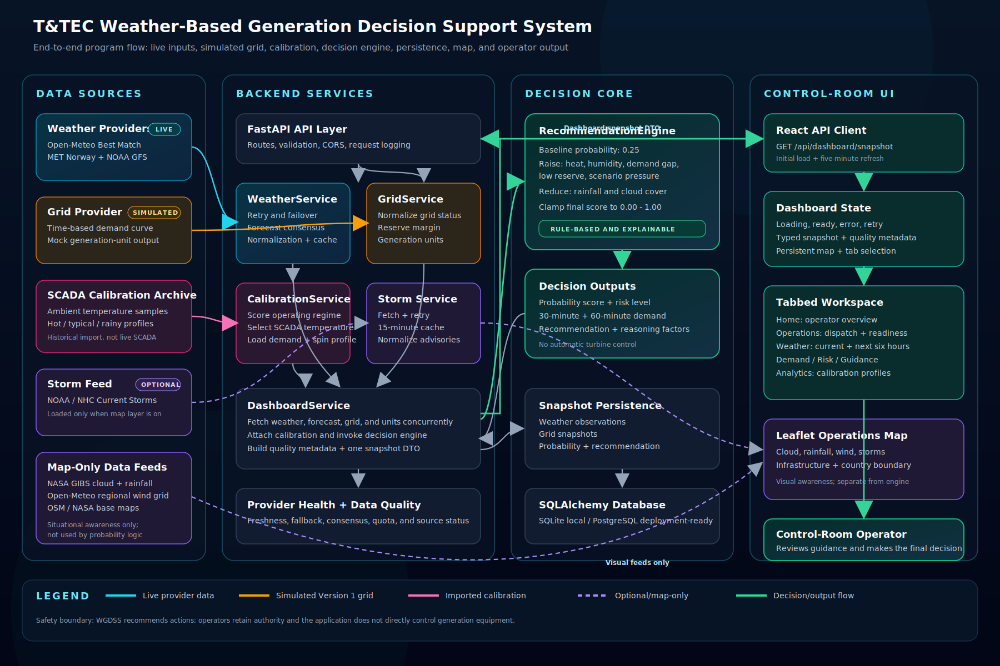

# WGDSS Visual Program Flow

The diagram below presents the complete active program flow from external data
sources through the backend services and decision engine to the control-room
dashboard.

## Reading the Diagram

- Cyan paths are live weather/provider data.
- Amber paths are Version 1 simulated grid data.
- Pink paths are imported historical SCADA and scenario calibration.
- Purple dashed paths are optional or map-only situational-awareness data.
- Green paths are decision outputs delivered to the operator.

The map overlays do not feed the recommendation engine. The probability engine
uses the normalized backend weather snapshot, simulated grid status, and
selected calibration profile. WGDSS presents guidance but does not directly
control generation equipment.

