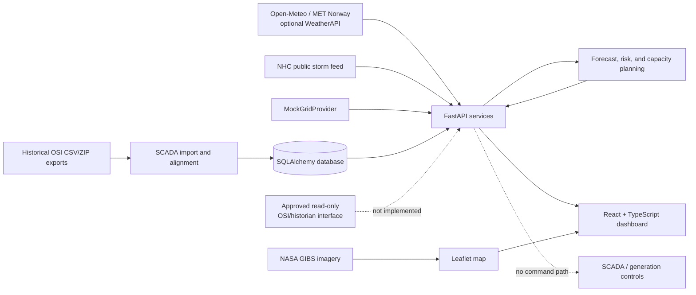
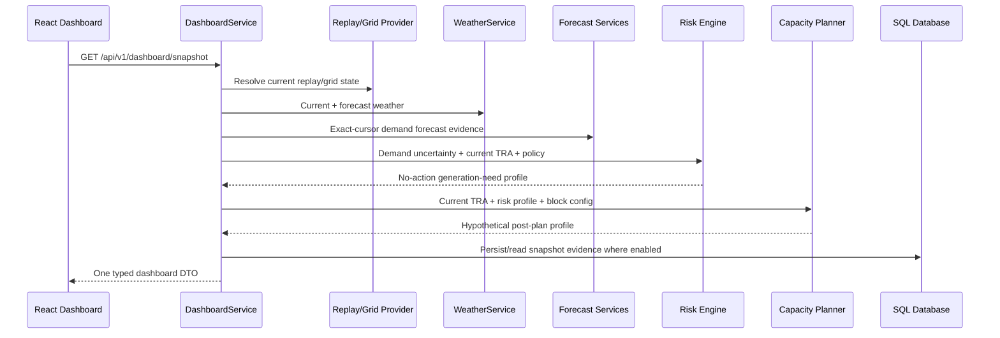

# WGDSS Architecture

## Context Diagram

## Runtime Data Flow

## Frontend

### Stack

- React 18 with the automatic JSX runtime.
- TypeScript 5.
- Vite 6.
- Tailwind CSS 3 plus application CSS in `frontend/src/index.css`.
- Leaflet/React-Leaflet for mapping.
- Chart.js/react-chartjs-2 for graphs.
- Vitest and Testing Library for component tests.

### Composition

`frontend/src/pages/Dashboard.tsx` owns the dashboard request, background
refresh, active workspace, theme, weather display mode, replay controls, and
capacity-plan what-if state.

The shell is a responsive map/workspace split:

- persistent `WeatherMap` on the left;
- day navigation, tab navigation, replay controls, and the active workspace on
  the right;
- internal panel scrolling at constrained resolutions rather than deliberate
  page-level horizontal scrolling.

Current workspaces are:

- Operator Overview
- Grid Operations
- Weather
- Demand Forecast
- Risk Gauge
- Operational Guidance
- Analytics
- Live SCADA Test (experimental branch)

`DashboardTimeProvider` supplies selected-day state to the tree and persists it
in local storage. It is not a general historical range state manager.

### Frontend API Boundary

`frontend/src/services/api.ts` is the HTTP client. It:

- reads `VITE_API_BASE_URL`;
- otherwise uses Vite's `/api` proxy to `127.0.0.1:8000`;
- applies a 20-second timeout;
- maps non-2xx responses to user-facing errors;
- uses TypeScript contracts in `frontend/src/types/`.

The normal UI receives weather, grid, forecast, risk, recommendation,
calibration, quality, model, replay, capacity-plan, and time context through a
single dashboard snapshot request.

## Backend

### Stack

- Python 3.12 in CI.
- FastAPI and Pydantic 2.
- SQLAlchemy 2 and Alembic.
- pandas/numpy/scikit-learn/joblib for data and modeling.
- requests for external HTTP providers.
- Uvicorn for local ASGI serving.

### Layers

| Layer | Responsibility | Main location |
|---|---|---|
| API | HTTP validation and response schemas | `backend/app/api/` |
| Schemas | Pydantic contracts | `backend/app/schemas/` |
| Services | orchestration, ingestion, forecasting, risk, persistence | `backend/app/services/` |
| Providers | weather/grid source adapters | `backend/app/providers/` |
| Models | SQLAlchemy persistence entities | `backend/app/models/` |
| Database | engine, sessions, initialization | `backend/app/database/` |
| Scripts | imports, replay, refresh, training, experiments | `backend/scripts/` |

FastAPI startup can initialize tables, import calibration data, and seed demo
replay data according to environment settings. Production-style configuration
sets `DATABASE_AUTO_CREATE=false` and uses Alembic migrations.

## Provider Architecture

### Grid

`GridProvider` defines asynchronous generation and grid-status methods.

Implemented:

- `MockGridProvider`: default normal-dashboard source.
- `ExcelSnapshotScadaProvider`: isolated immutable July experiment.

Reserved but not implemented:

- live SCADA provider;
- historian provider.

`grid_provider_factory.py` fails closed for unsupported provider selections.

### Weather

`WeatherProvider` defines current and forecast operations.

Implemented:

- `OpenMeteoProvider`: primary current/forecast provider.
- `MetNorwayProvider`: forecast consensus source.
- a second `OpenMeteoProvider(model="gfs_global")`: forecast cross-check.
- `WeatherAPIProvider`: optional credentialed fallback.
- `OpenMeteoReplayProvider`: archived/replay weather with cutoff handling.

`WeatherService` provides retry/failover, caching, health reporting,
normalization, hourly source reconciliation, and weighted geographic
aggregation.

## Map Architecture

`WeatherMap.tsx` uses:

- NASA GIBS Blue Marble as the default base and OpenStreetMap as an option;
- NASA GIBS GOES-East infrared cloud imagery;
- NASA GIBS IMERG precipitation imagery;
- a canvas wind-flow layer;
- NHC storm tracks;
- mock infrastructure markers and lines;
- weighted weather sample points and Trinidad/Tobago boundaries.

External map imagery is a visualization dependency. It is not persisted by the
backend and does not replace provider weather used by the forecasting engine.

## Persistence Boundary

The normal application persists to the configured SQLAlchemy database. Local
default is SQLite. A PostgreSQL URL is documented and the driver is installed,
but no production PostgreSQL deployment or data migration has been verified.

The July experiment writes session artifacts to the filesystem and deliberately
does not populate normal database tables.

## Current Deployment Shape

Implemented:

- Windows local launcher;
- manual Uvicorn and Vite development launch;
- GitHub Actions test/build workflow.

Not implemented:

- Dockerfile or Compose stack;
- production static frontend server;
- reverse proxy/TLS configuration;
- process supervision;
- centralized logs/metrics;
- production backup automation;
- high availability.

