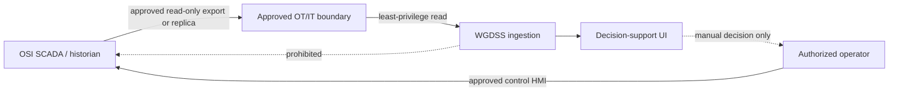

# Security and Governance

## Current Security Posture

WGDSS is suitable for local demonstration and controlled engineering review. It
is not ready for public, production, or OT-connected deployment.

Implemented safeguards:

- configurable explicit CORS allowlist; wildcard origins are filtered out;
- `X-Content-Type-Options: nosniff`;
- `X-Frame-Options: DENY`;
- `Referrer-Policy: no-referrer`;
- `Cache-Control: no-store` for API responses;
- request IDs and structured request logging;
- source hashes and provenance for historical/experimental imports;
- fail-closed grid-provider selection;
- no SCADA command/write functions;
- no live OSI endpoint or credentials in code;
- experimental sessions isolated from normal database tables;
- `.gitignore` rules for environment files, databases, logs, and sessions.

Production-blocking gaps:

- no login, authentication middleware, sessions, token validation, or SSO;
- no route authorization or role enforcement;
- no implemented user administration;
- no TLS listener/reverse-proxy configuration;
- no secret manager integration;
- no security audit-event model;
- no rate limiting, WAF, or abuse protection;
- no centralized vulnerability/dependency scanning policy;
- no penetration test or threat-model approval;
- no production identity, certificate, network, patching, or incident process.

The `users` table contains username, email, password hash, role, and active
fields, but no application code authenticates or authorizes against it.

## Authentication and Authorization Target

Authentication must be implemented before a managed deployment. T&TEC security
must select the identity source. Do not invent local credentials or an SSO
endpoint.

Minimum target:

- approved identity provider or controlled local identity only if authorized;
- MFA according to T&TEC policy;
- server-side session or validated short-lived token;
- role-based access enforcement on every API route;
- roles defined from approved duties, not guessed from the `users.role` string;
- account disablement, session revocation, and audit;
- separate privileges for viewing, replay control, import, model refresh,
  capacity what-if, and administration;
- no authorization decision in frontend code alone.

Suggested role concepts for review, not approved roles:

- read-only operator viewer;
- replay/test operator;
- data/import administrator;
- model reviewer/releaser;
- application administrator;
- security auditor.

## TLS

FastAPI and Vite currently run plain HTTP for local development. Production
must terminate TLS at an approved reverse proxy/load balancer or approved
application gateway.

Required decisions:

- DNS and certificate owner;
- internal/public PKI;
- allowed protocols/ciphers;
- certificate renewal and expiry alerting;
- HTTP-to-HTTPS behavior;
- HSTS policy;
- trust path for any outbound historian or weather TLS connection.

Never disable certificate validation to make a provider connection work.

## Secrets

Rules:

- keep database passwords, API keys, SCADA/historian credentials, private keys,
  and certificates out of Git;
- commit only placeholder `.env.example` files;
- use an approved runtime secret store;
- never put secrets in `VITE_*` variables because they are browser-visible;
- do not include secrets in logs, screenshots, test fixtures, source
  provenance, model metadata, or URLs;
- rotate and investigate any disclosed credential.

Repository observation:

- `backend/.env` is tracked in Git but is currently zero bytes;
- populated `.env` and `.env.*` files are ignored by root rules.

The tracked empty file should be removed from version control in a separate,
reviewed hygiene change. Its history must be scanned before anyone concludes
that no secret was previously committed.

## OT/SCADA Boundary

WGDSS must remain outside the safety-critical control path.

Requirements before a connector:

- complete `docs/SCADA_OSI_CONFIRMATION_REGISTER.md`;
- identify the exact installed OSI product/version and supported interface;
- approve source tag identifiers, units, quality, scan/aggregation, stale
  limits, and failover;
- use a dedicated read identity with no write/command/acknowledge permission;
- place access through an approved replica, export service, DMZ service, data
  diode, or equivalent utility-controlled path;
- enforce network allowlists and deny public OT exposure;
- log connector health and data provenance without credentials;
- prove that loss, staleness, or contradiction fails to `DATA UNAVAILABLE`.

No endpoint, protocol, namespace, bilateral table, certificate, or credential
has been supplied. None is invented here.

## Data Protection and Retention

Historical exports and model evidence may be operationally sensitive even if
they contain no personal data. T&TEC must classify:

- SCADA exports and tag metadata;
- generation/demand history;
- model artifacts and feature evidence;
- risk/recommendation records;
- logs and source paths;
- user and authentication records;
- backup copies.

Controls to define:

- storage encryption;
- backup encryption and key ownership;
- access and export restrictions;
- retention and deletion;
- environment separation;
- non-production data masking;
- audit retention;
- secure disposal.

## Application Hardening Backlog

1. Remove tracked runtime environment files and scan history.
2. Implement approved authentication and server-side RBAC.
3. Add TLS/reverse proxy deployment assets.
4. Add rate limiting and request-size controls for exposed endpoints.
5. Lock dependency versions through reviewed update policy and scanning.
6. Add security/audit events for login, import, model release, replay control,
   capacity evaluation, configuration change, and administrative action.
7. Restrict source paths and experiment routes by environment/role.
8. Define content security policy compatible with Leaflet/map providers.
9. Threat-model external providers, source ingestion, model artifacts, and the
   OT boundary.
10. Conduct restore tests, vulnerability testing, and incident exercises.

## Governance Records

Before production, maintain approved records for:

- data contract and tag semantics;
- reserve/generation policy;
- model dataset, feature profile, code version, artifact hash, and approval;
- deployment commit/image and migration revision;
- security review;
- operator acceptance;
- backup/restore test;
- incident and rollback owner;
- third-party weather/map service terms and availability.

